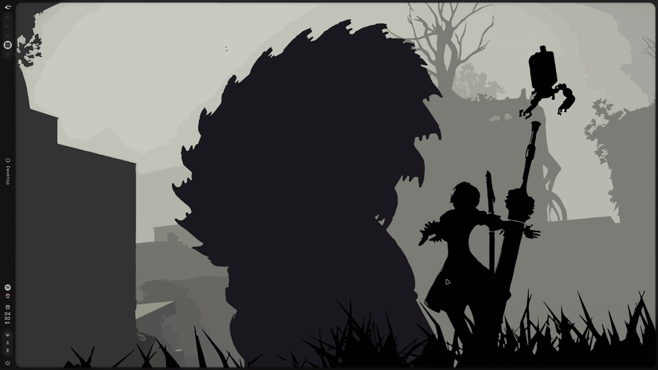

# 🌌 Caelestia Hyprland Desktop Suite (Debian & Universal Linux)

[](https://hyprland.org)
[](https://quickshell.outfoxxed.me)
[](https://python.org)
[](https://debian.org)
[](LICENSE)

A standalone, non-destructive, and distribution-safe port of the **Caelestia Desktop Environment** for Hyprland on **Debian, Parrot OS, Ubuntu**, and general Linux distributions.

<p align="center">
  
</p>

---

## ✨ Features

- 🎨 **Dynamic Material You Theming:** Wallpaper colors extracted on-the-fly and applied to Foot, Fuzzel, Discord, Spicetify, GTK, and Quickshell widgets.
- 🪟 **Special Workspace Scratchpads:** Instant sliding overlays for **Spotify** (`Super + M`), **Discord** (`Super + D`), **WhatsApp** (`Super + Alt + D`), **Todoist** (`Super + R`), and **Btop** (`Ctrl + Shift + Esc`).
- 📊 **Interactive Drawers:**
  - **Top Dashboard:** Media player, CPU/RAM performance telemetry, and quick toggles (`Super + K`).
  - **Fuzzy App Launcher:** Fast application and command menu (`Super`).
  - **Notification Sidebar:** Notification center with Caffeine mode and quick settings (`Super + N`).
  - **Nexus Control Center:** Integrated wallpaper browser and style picker (`Super + Shift + W`).
  - **Session Menu:** Power management options (`Ctrl + Alt + Delete`).
  - **Lock Screen:** PAM-authenticated glowing lock screen (`Super + L`).
- 🛡️ **Zero-Breakage Installer:** Fully modular setup with **automatic timestamped backups**, dry-run simulation, and clean rollback support.
- 📦 **100% In-Tree & Offline Ready:** Includes complete Python CLI source code with zero external AUR or Arch package manager dependencies.

---

## 🚀 Quick Start

### 1. Clone the repository
```bash
git clone https://github.com/debarch777/caelestia-debian.git
cd caelestia-debian
```

### 2. Run the Installer
```bash
# Run interactive installer (or preview with --dry-run)
./install.sh
```

To run a fully automated unattended installation:
```bash
./install.sh --all
```

---

## ⌨️ Essential Keybindings

| Shortcut | Action | Description |
| :--- | :--- | :--- |
| **`Super`** *(tap)* | **Launcher** | Fuzzy search apps & commands |
| **`Super + K`** | **Dashboard** | Media controls, performance monitors, weather |
| **`Super + N`** | **Sidebar** | Notification center, DND, and quick toggles |
| **`Super + M`** | **Spotify** | Music scratchpad overlay |
| **`Super + D`** | **Discord** | Communication scratchpad overlay |
| **`Super + Alt + D`**| **WhatsApp** | Standalone WhatsApp desktop client |
| **`Super + R`** | **Todoist** | Tasks scratchpad overlay |
| **`Ctrl + Shift + Esc`**| **System Monitor** | Btop system monitor scratchpad |
| **`Super + Shift + W`**| **Nexus** | Wallpaper browser & theme generator |
| **`Super + V`** | **Clipboard** | Clipboard history manager |
| **`Super + .`** | **Emoji Picker**| Emoji search and copy |
| **`Print`** | **Screenshot** | Fullscreen capture to clipboard & files |
| **`Super + Shift + S`**| **Area Screenshot**| Freeze area selection & annotation |
| **`Ctrl + Alt + R`** | **Recording** | 60 FPS screen recorder |
| **`Super + Q`** | **Close Window** | Close focused window |
| **`Super + F`** | **Fullscreen** | Toggle fullscreen |
| **`Super + Alt + Space`**| **Floating** | Toggle window floating/tiling |

📖 **See [docs/CHEATSHEET.md](docs/CHEATSHEET.md) for the complete list of all shortcuts and gestures.**

---

## 📂 Repository Structure

```
caelestia-dots/
├── install.sh                     # Modular, safe installer script
├── uninstall.sh                   # Backup restorer and uninstaller
├── caelestia-cli/                 # Standalone Python CLI & Material You Theming engine
│   ├── pyproject.toml / setup.py
│   ├── src/caelestia/
│   └── data/                      # Bundled schemes, templates, emojis
├── config/                        # Desktop dotfiles
│   ├── hypr/                      # Hyprland 0.55+ Lua configs & window rules
│   ├── quickshell/caelestia/      # Quickshell 0.3.1 QML desktop shell
│   ├── foot/                      # Terminal emulator
│   ├── fuzzel/                    # Application & emoji launcher
│   ├── btop/                      # System monitor
│   ├── swappy/                    # Screenshot annotation
│   └── gtk-3.0 / qt6ct            # Desktop theming
├── bin/                           # Universal app binary wrappers
├── pam/                           # PAM lockscreen authentication rules
├── wallpapers/                    # Curated starter wallpapers
└── docs/                          # Guides
    ├── CHEATSHEET.md              # Complete shortcuts reference
    ├── INSTALL.md                 # Detailed manual installation steps
    └── TROUBLESHOOTING.md         # Troubleshooting & common fixes
```

---

## 🛠️ Testing & Dry-Run

You can preview the installation without modifying any files:
```bash
./install.sh --dry-run
```

To back up your current configuration without installing anything:
```bash
./install.sh --backup-only
```

To restore your previous setup if needed:
```bash
./uninstall.sh
```

---

## 📜 License
GPL-3.0 License. See [LICENSE](LICENSE) for details.
